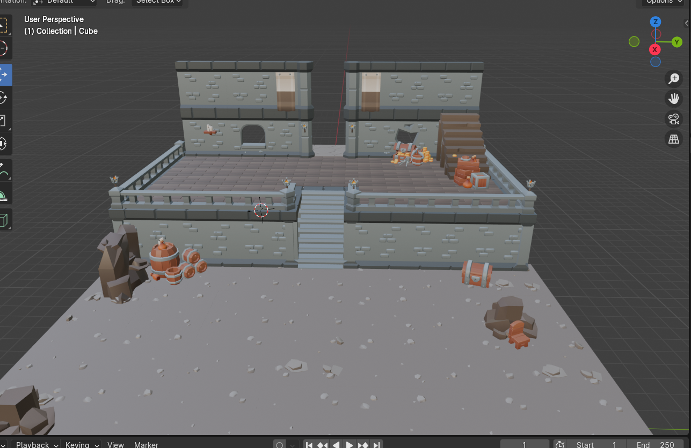

# Project Title

Bones and Shadows

## Overview

The Bones and Shadows game is an immersive adventure set in a fantasy world filled with dungeons, monsters, and treasures waiting to be discovered. Players take on the role of a brave adventurer who embarks on a perilous journey through various levels of dungeons, encountering challenges and battles along the way. With stunning visuals and engaging gameplay mechanics, players will delve deep into the depths of the dungeons, facing off against formidable foes and uncovering the secrets hidden within.

### User Profile

The target audience for the Dungeon RPG game includes:

- **Gamers**: Fans of RPGs and dungeon-crawling adventures seeking an immersive gaming experience.
- **Casual Players**: Those looking for a fun and accessible game with intuitive controls and captivating gameplay.

### Features

The Dungeon RPG game will include the following features:

- **Immersive Dungeon Exploration**: Players can explore intricately designed dungeons filled with traps, puzzles, and secrets to uncover.
- **Real-time Combat**: Engage in real-time combat with a variety of enemies, each with unique abilities and behaviors.
- **Character Progression**: Level up your character, unlock new skills, and customize your abilities to suit your playstyle.
- **Rich Storyline**: Experience a compelling narrative with intriguing characters, plot twists, and multiple endings based on player choices.
- **Stunning Visuals**: Enjoy breathtaking graphics and atmospheric environments that bring the world of the game to life.
- **Multiplayer Support**: Team up with friends in cooperative multiplayer mode or compete against other players in PvP battles.
- **Dynamic Events**: Encounter dynamic events and random encounters that add unpredictability and excitement to your adventures.
- **Endless Replayability**: Explore procedurally generated dungeons and participate in daily challenges to keep the gameplay fresh and engaging.

### Tech Stack

- React

- Three.js

- React Three Fiber

- Sass

### Sitemap

- Starting Map (training map)
- Levels (Each level has a different map)

### Mockups

#### Starting Map

#### Main Character

#### Enemies

## Roadmap

- Learn Three.js

- Learn React Three Fiber

- Build a temporary map.

- Add physics to the map

- Add main character to the map

- Add hitbox to the main character and add physic based character controller.

- Add basic enemy character with physics and hit boxes to work on to combat mechanics

- Add stats for the main character.

- Add combat detection to make character available to give or take damage.

- Randomize the enemy movements to have a natural game play.

- Add distance detection to the enemy to chase and attack to main character.

- Add more maps (Levels) to the game.

- Add final Boss to the game

- Bug fixes

- Optimization to make the user have more frame rate per second.

- DEMO DAY

## Nice-to-haves

- **Quest System**: Implement a quest system where players can undertake various tasks or missions given by NPCs (Non-Player Characters) within the game world. Completing quests could reward the player with experience points, items, or access to new areas.

- **Character Customization**: Provide players with options to customize their character's appearance, skills, and abilities. This could involve choosing different classes or skill trees to specialize in.

- **Multiplayer Support**: Consider adding multiplayer functionality to allow players to team up with friends or compete against each other in cooperative or competitive gameplay modes.

- **Dynamic NPC Interactions**: Create dynamic NPC interactions where the player's choices and actions influence the behavior and responses of NPCs throughout the game.
